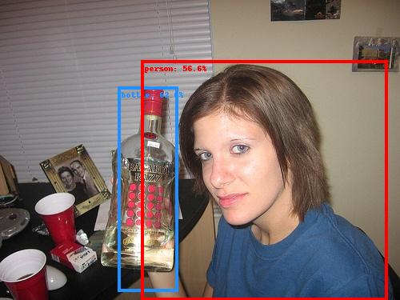
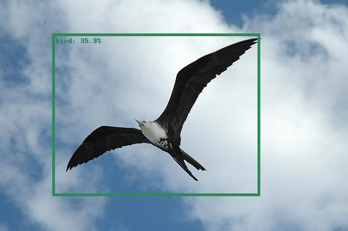
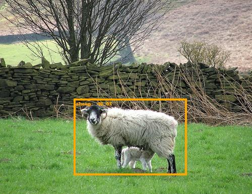

# YOLO v1: PyTorch Implementation from Scratch
The following repository implements the paper
[You Only Look Once: Unified, Real-Time Object Detection](https://arxiv.org/abs/1506.02640) in PyTorch. The code follows
the official implementation of the [Darknet](https://github.com/pjreddie/darknet) repository, which has some slight
differences compared to the paper:

- The most important difference is pertinent to the model's architecture. Specifically, the first Fully Connected Layer
is replaced by a Locally Connected Layer. In the paper, the architecture of the YOLO model is the following:

- A Batch Norm operation is used in each convolutional layer, after the convolution operation and before the activation
function.
- The learning rate schedule and the max_batches for which the network was trained.

This repository implements the paper from scratch, including:
+ pretraining with the ImageNet dataset, and
+ training with the VOC training set (train/val 2007 + train/val 2012)
+ evaluation with VOC test set (test 2007)

## Results

The mean average precision was measured following the interpolation operation that is described in the paper 
[The PASCAL Visual Object Classes Challenge: A Retrospective](http://host.robots.ox.ac.uk/pascal/VOC/pubs/everingham15.pdf).
Furthermore, as instructed for evaluating the performance of a detection model in the PASCAL VOC dataset, the difficult
objects in the PASCAL VOC test set are not considered. Furthermore, the bounding boxes of the difficult objects were
also ignored during training to obtain a better Mean Average Precision.

|  Implementation  |  Mean Average Precision  |
|:----------------:|:------------------------:|
| this repository  |          63.6%           |
|      paper       |          63.4%           |

## Visualizing the Predictions
The following annotated images belong the PASCAL VOC test set and the percentage value corresponds to the probability 
that there is an object in the bounding box. 

## Citations
- Joseph Redmon, Santosh Kumar Divvala, Ross B. Girshick, & Ali Farhadi (2015). You Only Look Once: Unified, Real-Time Object Detection. CoRR, abs/1506.02640.
- Mark Everingham, S. M. Ali Eslami, Luc Van Gool, Christopher K. I. Williams, John M. Winn, & Andrew Zisserman (2014). The Pascal Visual Object Classes Challenge: A Retrospective. International Journal of Computer Vision, 111, 98-136.
